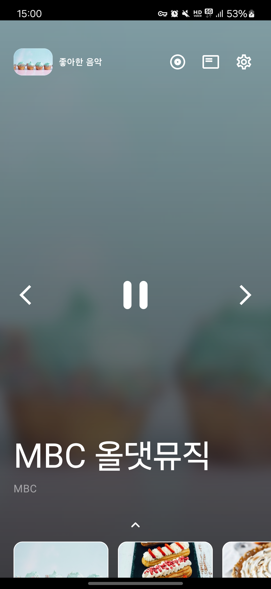
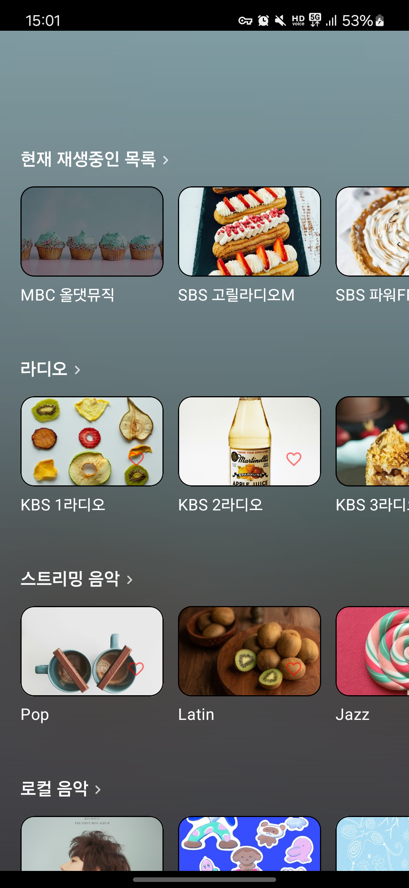
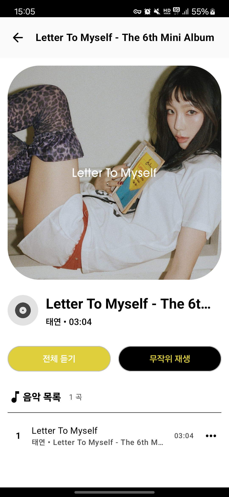
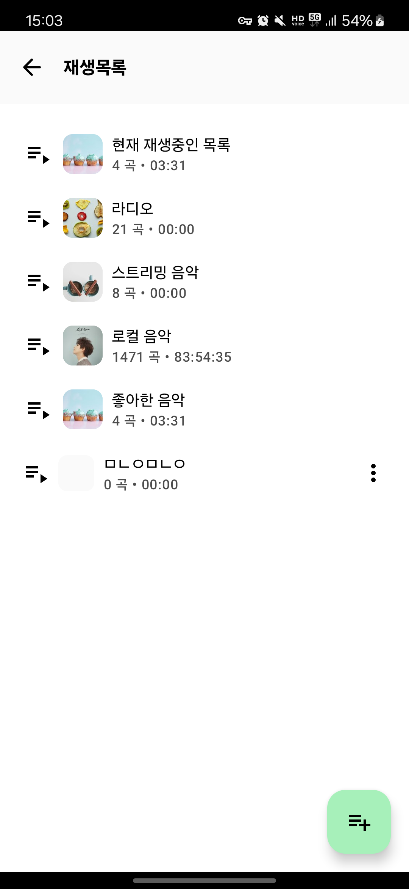
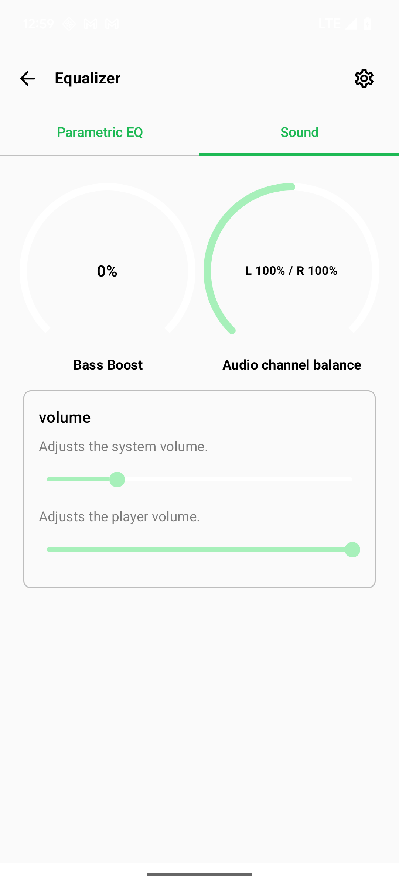
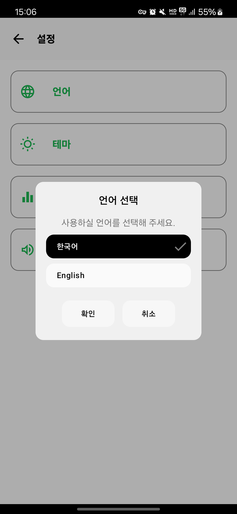

    
    <h1>ToyPlayer</h1>
    
An Android application for play music

**ToyPlayer** is my digital playground for experimenting with new ideas, technologies, and architectures in Android development.  
It supports **radio playback**, **local music files**, and **free streaming audio** — all in one app.

If you’d like to contribute or leave feedback, it’s very appreciated!

---

## 🚀 Features
- 📻 **Live radio streaming** (KBS, MBC, SBS, etc.)
- 📻 **Free streaming** (Pop, Latin, Jazz, Classic, etc.)
- 🎧 Built on **Media3** (MediaLibraryService)
- 🔄 **Custom ExoPlayer middleware**:
  - Custom `MediaSource` handling (e.g. radio wrapping)
  - Custom `AudioProcessor` for sample-level transformation
  - Custom `ResolvingDataSource` for deferred URL resolution
- 🔐 **Encrypted ExoPlayer cache**
  - Adds AES encryption on top of default SimpleCache
  - Decrypts on-the-fly for secure audio playback
- 🎚️ **Parametric Equalizer** with multi-band control
- 🚗 **Android Auto** support
- 📝 Local playlist management
- 🎬 Smooth **MotionLayout UI**
- 🎨 Supports light / dark Theme
- 🌐 Multilingual: **English**, **Korean**
- ⏺️ Background playback

## Preview

  
  
  
  
  
  
  
  

