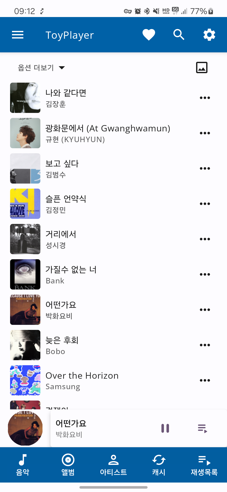
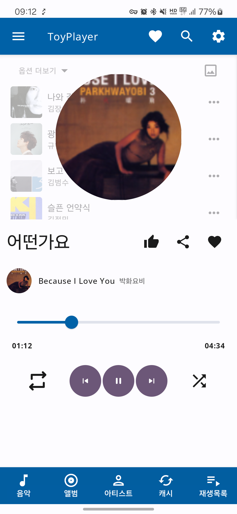
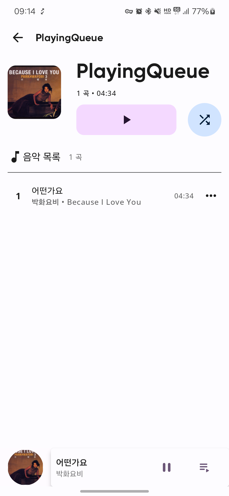
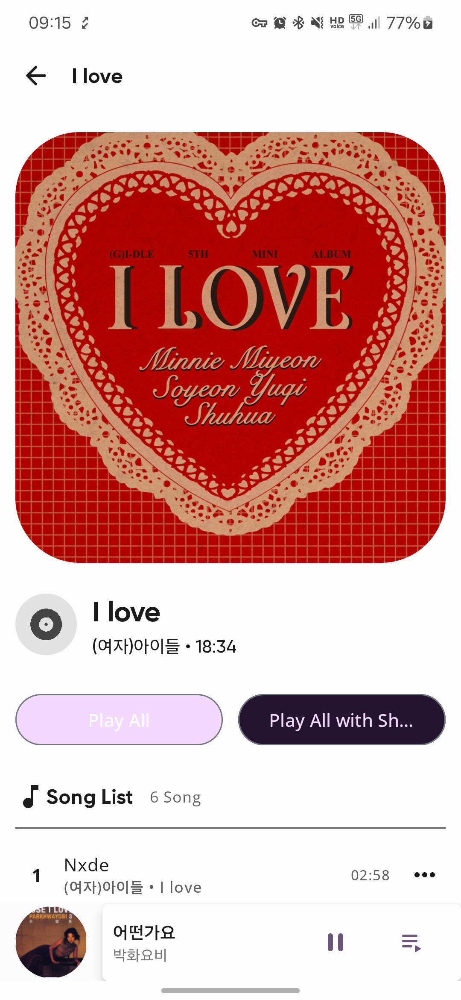
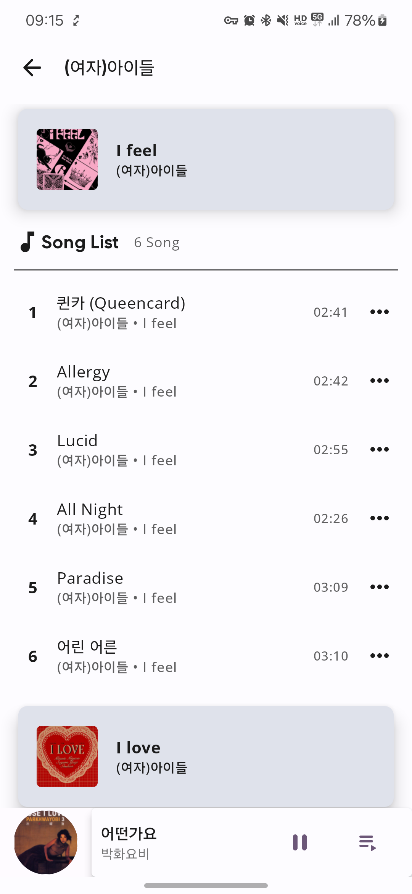

    
    <h1>ToyPlayer</h1>
    
An Android application for play music

This project is my digital playground where I am learning.

I'm testing new technologies and ideas here.

If you like to contribute, that is very appreciated.

---

## Features
- Play (almost) any song (local, remote, assets)
- Media3 : MediaLibraryService
- Background playback
- Cache audio with AES encryption and decrypt and play the file.
- Late init media url when preparing playback. (ResolvingDataSource.Resolver)
- Android Auto
- Local playlist management
- Multiple Theme light/dark/dynamic
- Multiple language (Eng, Kor)

## Preview

  
  
  
  
  

## Architecture
Architecture is strongly based on
the [Hexagonal Architecture](https://alistair.cockburn.us/hexagonal-architecture/) by Alistair
Cockburn.

* **app** - The Application module. It contains all the initialization logic for the Android
  environment.
* **features** - The module/folder containing all the features (visual or not) from the application.
* **domain** - The modules containing the most important part of the application: the business
  logic. This module depends only on itself and all interaction it does is via _dependency
  inversion_.
* **data** - The module containing the data (local, remote, light etc) from the app.